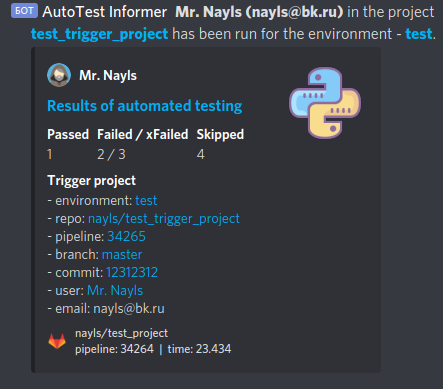
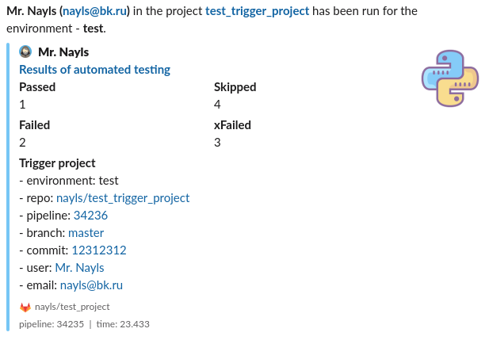

# notify

[](https://microbadger.com/images/naylscloud/notify:latest)
[](https://microbadger.com/images/naylscloud/notify:latest)

> `1.1`,`latest`

```
DOCKER_BUILDKIT=1 docker build -t nayls-cloud/notify ./
```
Discord preview



Slack preview



## How to use

Pipeline - Trigger project

```yaml
stages:
    - trigger

test-project-trigger:
    stage: trigger
    variables:
        PRE_CI_SERVER_URL: ${CI_SERVER_URL}

        PRE_CI_ENVIRONMENT_SLUG: test
        PRE_CI_ENVIRONMENT_URL: https://undefined.localhost/

        PRE_CI_PIPELINE_SOURCE: ${CI_PIPELINE_SOURCE}
        PRE_CI_PIPELINE_URL: ${CI_PIPELINE_URL}
        PRE_CI_PIPELINE_ID: ${CI_PIPELINE_ID}

        PRE_CI_COMMIT_REF_NAME: ${CI_COMMIT_REF_NAME}
        PRE_CI_COMMIT_SHA: ${CI_COMMIT_SHA}

        PRE_CI_COMMIT_REF_NAME: ${PRE_CI_COMMIT_REF_NAME}
        PRE_CI_COMMIT_REF_SLUG: ${PRE_CI_COMMIT_REF_SLUG}
        PRE_CI_COMMIT_SHA: ${PRE_CI_COMMIT_SHA}
        PRE_CI_COMMIT_SHORT_SHA: ${PRE_CI_COMMIT_SHORT_SHA}

        PRE_CI_JOB_NAME: ${CI_JOB_NAME}

        PRE_CI_PROJECT_NAME: ${CI_PROJECT_NAME}
        PRE_CI_PROJECT_TITLE: ${CI_PROJECT_TITLE}
        PRE_CI_PROJECT_URL: ${CI_PROJECT_URL}
        PRE_CI_PROJECT_PATH: ${CI_PROJECT_PATH}

        PRE_GITLAB_USER_NAME: ${GITLAB_USER_NAME}
        PRE_GITLAB_USER_LOGIN: ${GITLAB_USER_LOGIN}
        PRE_GITLAB_USER_EMAIL: ${GITLAB_USER_EMAIL}
    trigger:
        project: gitlab.com/nayls/example_trigger
        branch: master
        strategy: depend
```

Pipeline test project

```yaml

.discord:
  image: naylscloud/notify:latest
  stage: inform
  variables:
    GIT_STRATEGY: none
    # DISCORD_WEBHOOK: "https://discordapp.com/api/webhooks/<secret>"
    # DISCORD_PING_ROLES: "<@&idrole>" # \@role in discord chat
  dependencies:
    - e2e
  before_script:
    - PASSED_VALUE=$(cat results/pytest_result.json | jq -r '.passed')
    - FAILED_VALUE=$(cat results/pytest_result.json | jq -r '.failed')
    - XFAILED_VALUE=$(cat results/pytest_result.json | jq -r '.xfailed')
    - SKIPPED_VALUE=$(cat results/pytest_result.json | jq -r '.skipped')
    - DURATION_VALUE=$(cat results/pytest_result.json | jq -r '.duration')
  script:
    - discord -v
```

```yaml
slack:
  image: naylscloud/notify:latest
  stage: inform
  variables:
    GIT_STRATEGY: none
    # SLACK_WEBHOOK: "https://hooks.slack.com/services/<secret>"
    # SLACK_CHANNEL: "#general"
    # SLACK_PING_ROLES: "@nayls"
  dependencies:
    - e2e
  before_script:
    - PASSED_VALUE=$(cat results/pytest_result.json | jq -r '.passed')
    - FAILED_VALUE=$(cat results/pytest_result.json | jq -r '.failed')
    - XFAILED_VALUE=$(cat results/pytest_result.json | jq -r '.xfailed')
    - SKIPPED_VALUE=$(cat results/pytest_result.json | jq -r '.skipped')
    - DURATION_VALUE=$(cat results/pytest_result.json | jq -r '.duration')
  script:
    - slack -v
```

Add in conftest.py

```python
def pytest_terminal_summary(terminalreporter, exitstatus, config):
    import time
    passed_count = len(terminalreporter.stats.get("passed", []))
    failed_count = len(terminalreporter.stats.get("failed", []))
    xfailed_count = len(terminalreporter.stats.get("xfailed", []))
    skipped_count = len(terminalreporter.stats.get("skipped", []))
    duration = format(time.time() - terminalreporter._sessionstarttime, '.3f')

    print("passed amount:", passed_count)
    print("failed amount:", failed_count)
    print("xfailed amount:", xfailed_count)
    print("skipped amount:", skipped_count)
    print("duration:", duration)

    import json
    data = {}
    data["passed"] = passed_count
    data["failed"] = failed_count
    data["xfailed"] = xfailed_count
    data["skipped"] = skipped_count
    data["duration"] = duration

    with open("results/pytest_result.json", "w") as outfile:
        json.dump(data, outfile)
```